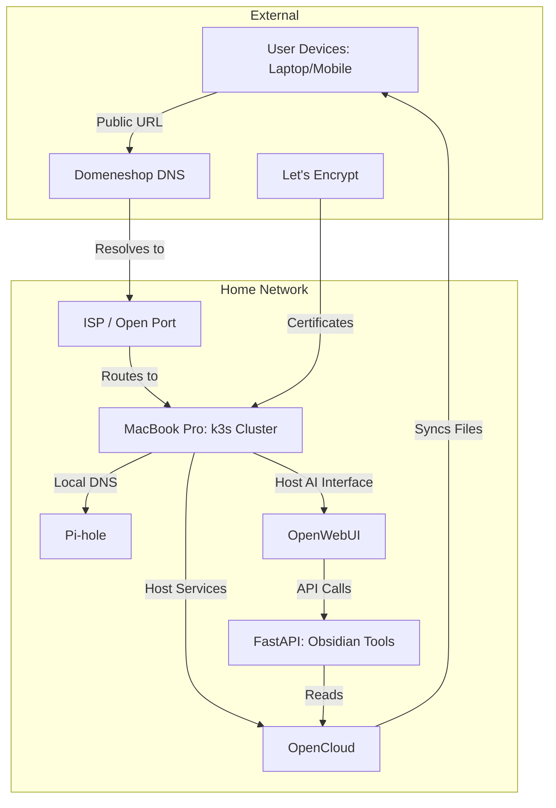

## Motivation: Beyond the Dust

As a tech enthusiast, I have a habit of accumulating "retired" hardware. Over the years, several iPhones and Macs have ended up in drawers, simply collecting dust. I wanted to change that—not just to give them a second life, but to reclaim my digital sovereignty.

My goal wasn't just to build a server; it was to build a private ecosystem. I wanted to host my own personal ChatGPT interface (via Open WebUI) and my own private "Google Drive/Dropbox" (via OpenCloud). I wanted my data to live on my hardware, under my control, rather than in a corporate cloud.

I looked at a 2017 MacBook Pro sitting in my drawer. It still ran, even if the keyboard was a bit temperamental. I thought: *Why not turn this into a "free" Kubernetes cluster?* 

So, the journey began.

---

## The Setup: From Silicon to Kubernetes

The first step was the basics. I installed Ubuntu 24.04 Desktop, using an old Raspberry Pi SD card to handle the BIOS installation since I didn't have a spare USB drive handy. It was a slow start, but we were moving.

The first real hurdle was the hardware itself—specifically, getting the Broadcom Wi-Fi drivers to behave. After a frustrating session of trying to modify official driver source code with Claude's help, I eventually found a script that actually worked: [https://gist.github.com/torresashjian/e97d954c7f1554b6a017f07d69a66374](https://gist.github.com/torresashjian/e97d954c7f1554b6a017f07d69a66374). I had to ensure this script runs on every restart, so as long as the Mac is powered, the Wi-Fi stays up.

Once I was online, I wanted a setup that felt modern. I enabled SSH for remote management, but for the actual updates, I wanted a "GitOps" workflow. I deployed **k3s** for lightweight orchestration and connected it to **Flux CD**. This meant that instead of manual configuration, Flux would pull directly from my **GitLab** repository and automatically apply any changes to the cluster.

### The "Genius" Plan (and the CG-NAT Reality Check)

Once the core system was humming, I decided to get "clever." 

I wanted to host my services so they were accessible from anywhere, but I didn't want to pay my ISP for a static IP. *I'll be smart about this,* I thought. *I'll just write a simple Python script that checks my public IP every 15 minutes and updates my domain's A records via an API. No static IP? No problem!*

I even set up a `takk` job to automate this. I felt like a networking wizard.

**I was wrong.**

As it turns out, my network provider was using **CG-NAT** (Carrier-Grade NAT). My "clever" script was perfectly updating my domain to point to an IP address that didn't actually lead back to my house. I was essentially shouting into a void. 

Thankfully, a quick, slightly humbling phone call to my network provider solved it—they opened up a port for me, finally allowing the outside world to actually reach my MacBook.

### The Pivot to Public: Why HTTPS Matters

Now, I could have theoretically kept everything on my local network and accessed it via a VPN. However, I ran into a practical roadblock: **OpenCloud requires HTTPS** to function properly.

To get real SSL certificates and a professional setup, I needed a proper public endpoint. This led me to **Domeneshop.no**. They are a fantastic local DNS provider that not only offers a great API for my IP-update script but also integrates beautifully with Let's Encrypt through a webhook adaptor. This meant that once my DNS was pointing to my host, the cluster could automatically handle SSL certificates, making the whole experience seamless and secure.

### Managing the Chaos with Takk

With the network and DNS stable, I started deploying the "big" services: **OpenCloud** for my files and **Open WebUI** for my AI. 

However, as I added more services—requiring Postgres databases, Redis caches, MinIO storage, and complex SSL certificates—the Kubernetes YAML files started to become a nightmare. I found myself constantly fighting with incorrect service names, misconfigured environment variables, and metadata mismatches.

This is where the project shifted from "playing with k8s" to "building a professional system." To manage this complexity, I turned to **takk**—an infrastructure-as-code framework that I maintain. 

Instead of writing hundreds of lines of brittle YAML, I define my infrastructure in Python. **takk** handles the heavy lifting: it generates the k8s configs, ensures all secrets and environment variables are consistent across services, and manages the relationships between third-party resources like databases and the apps that need them.

```python
from typing import Annotated
from pydantic import AnyUrl, Field, PostgresDsn
from pydantic_settings import BaseSettings
from takk import Project, NetworkApp, ServiceUrl
from takk.secrets import PostgresHost, PostgresName, PostgresPassword, PostgresUsername, S3AccessKey, S3BucketName, S3Endpoint, S3RegionName, S3SecretKey

class OpenWebUISettings(BaseSettings):
    database_url: PostgresDsn
    s3_bucket_name: S3BucketName
    s3_region_name: S3RegionName
    s3_endpoint_url: S3Endpoint
    s3_secret_access_key: S3SecretKey
    s3_access_key: S3AccessKey
    # Currently using Scaleway for the heavy lifting, 
    # but this architecture makes it trivial to point to a local LLM later.
    openai_api_base_url: str = "https://api.scaleway.ai/v1"
    openai_api_key: str = "... "

project = Project(
    name="infra",
    chat=NetworkApp(
        docker_image="ghcr.io/open-webui/open-webui:v0.8.6",
        port=8080,
        settings=[OpenWebUISettings]
    )
)
```

### The "Aha!" Moment: Connecting my Brain to my AI

With the infrastructure stable, I hit the most rewarding part of the project. 

I had my files in OpenCloud and my AI in Open WebUI, but they were living in separate worlds. My chat interface could talk to me, but it couldn't "see" my data. I couldn't ask it, *"What were my notes on the project from yesterday?"*

I needed a bridge. Since there wasn't a standard way to expose OpenCloud files to an LLM, I built one using **FastAPI**. I created a custom toolset that exposed my Obsidian paths, tags, and backlinks via an API.

Suddenly, the magic happened. I could ask my self-hosted AI:
> *"List out a few items with the 'Papers' tag."*

Because I was using **takk**, adding this new FastAPI "bridge" to my cluster was trivial. I just added it to my `Project` config, and the cluster handled the rest. I even extended this to **Neovim**, allowing me to get inline AI completions in my terminal that could actually "read" my local files.

```python
project = Project(
    # ... existing config
    obsidian_tools=FastAPIApp(
        app="src.takk_k8s.obsidian_tools:app",
        settings=[ObsidianToolsSettings],
        compute=Compute(mvcpu_limit=250, mb_memory_limit=256)
    )
)
```

### Scaling and Staying Sane

Once the "brain" was connected, I realized a cluster is only useful if it stays online. I didn't want to find out my setup was broken only when I tried to use it. 

I used the same logic to add **MCP (Model Context Protocol)** servers to monitor my cluster's health and added Prometheus-based **Alerting**. Now, if a service enters a crash loop or a job fails, I get an email immediately. Everything—from the network to the alerts—is defined in code.

```python
project = Project(
    # ... existing config
    alerts=[
        Alert(
            name="CrashLoop",
            query="increase(kube_pod_container_status_restarts_total[1h]) > 2",
            notify=[mats],
            severity="critical"
        ),
        Alert(
            name="FailingJobs",
            query="...",
            severity="critical",
            notify=[mats]
        ),
    ],
)
```

## Network Architecture



## Future Horizons

What started as a way to clear out a desk drawer has turned into a fully functioning, self-sovereign digital headquarters. I own my data, I own my AI, and I own the code that runs it all.

The next steps?
1.  **Heavy Lifting:** Moving from Scaleway to a dedicated machine with a GPU for fully local, high-speed LLMs (Gemma 4, etc.).
2.  **Self-Healing:** Integrating a coding agent that can monitor the logs and suggest (or apply) fixes to the cluster itself.
3.  **Hardened Backups:** Moving from "syncing" to a professional backup strategy using tools like Velero.

**What do you think? If you've ever tried to host your own AI or struggled with the "joy" of CG-NAT, I'd love to hear your thoughts in the comments!**
